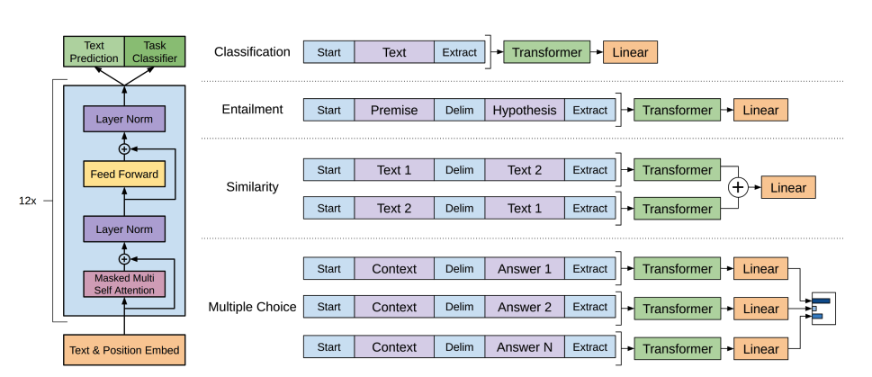
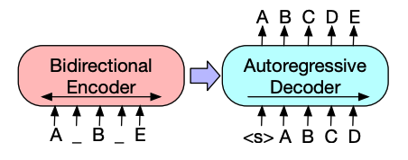
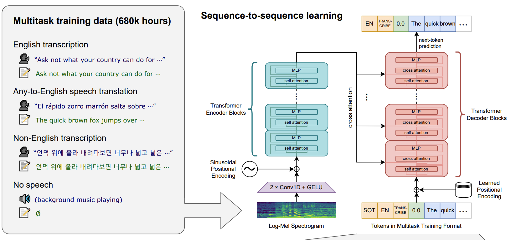
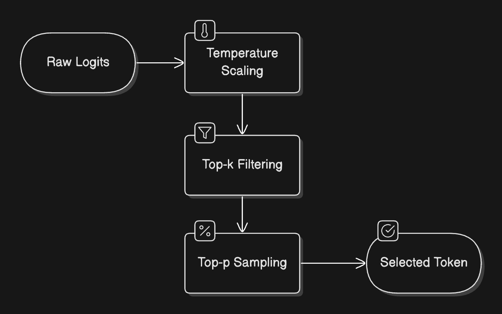

# 📚 LLM Notes

[(This notes are based on "LLM Course" by Hugging Face)](https://huggingface.co/learn/llm-course/en)

## 📑 Table of Contents

### Chapter 1. Transformer models

- [Natural Language Processing and Large Language Models](#natural-language-processing-and-large-language-models)
  - [What is NLP?](#what-is-nlp)
  - [Large Language Models (LLMs)](#large-language-models-llms)
  - [Limitations of LLMs](#limitations-of-llms)
  - [Challenges in Language Processing](#challenges-in-language-processing)
- [Transformers, what can they do?](#transformers-what-can-they-do)
  - [Capabilities](#capabilities)
  - [Pipeline Function](#pipeline-function)
  - [Modalities](#modalities)
- [How do Transformers work?](#how-do-transformers-work)
  - [History](#history)
  - [Transformer Architecture](#transformer-architecture)
  - [Attention Mechanism](#attention-mechanism)
  - [Transfer Learning](#transfer-learning)
- [Solving Tasks with Transformers](#solving-tasks-with-transformers)
  - [General Task-Solving Pattern](#general-task-solving-pattern)
  - [Language Model Training Approaches](#language-model-training-approaches)
  - [Text Tasks](#text-tasks)
  - [Speech and Audio Tasks](#speech-and-audio-tasks)
  - [Computer Vision Tasks](#computer-vision-tasks)
- [Inference with LLMs](#inference-with-llms)
  - [Understanding the Basics](#understanding-the-basics)
  - [The Role of Attention](#the-role-of-attention)
  - [Context Length and Attention Span](#context-length-and-attention-span)
  - [The Two-Phase Inference Process](#the-two-phase-inference-process)
  - [Sampling Strategies](#sampling-strategies)
  - [Practical Challenges and Optimization](#practical-challenges-and-optimization)
- [Bias and Limitations](#bias-and-limitations)
  - [Sources of Bias](#sources-of-bias)
  - [Examples of Bias in Practice](#examples-of-bias-in-practice)
  - [Implications for Production Use](#implications-for-production-use)
- [Summary](#summary)
  - [Key Concepts Covered](#key-concepts-covered)
  - [Model Architectures and Applications](#model-architectures-and-applications)
  - [Looking Ahead](#looking-ahead)

# Natural Language Processing and Large Language Models

## What is NLP?

NLP is a field combining linguistics and machine learning to understand human language in context. Common NLP tasks include:

- Sentence classification (sentiment analysis, spam detection)
- Word-level classification (part-of-speech tagging, named entity recognition)
- Text generation
- Question answering
- Translation and summarization

## Large Language Models (LLMs)

LLMs have revolutionized NLP with models like GPT and Llama. Key characteristics:

- Massive scale (billions of parameters)
- General capabilities across multiple tasks
- In-context learning from examples in prompts
- Emergent abilities not explicitly programmed

## Limitations of LLMs

- Hallucinations (generating incorrect information)
- Lack of true understanding
- Bias from training data
- Limited context windows
- High computational requirements

## Challenges in Language Processing

Text processing for machines differs from human understanding. Computers struggle with:

- Ambiguity
- Cultural context
- Sarcasm and humor
- Semantic understanding

# Transformers, what can they do?

## Capabilities

Transformer models can solve tasks across multiple modalities, including:

- Natural language processing
- Computer vision
- Audio processing
- Multimodal applications

## Pipeline Function

The `pipeline()` function in the 🤗 Transformers library connects a model with preprocessing and postprocessing steps:

1. Text is preprocessed into model-compatible format
2. Preprocessed inputs are passed to the model
3. Model predictions are post-processed for human interpretation

## Modalities

### Text Pipelines

- **Text generation**: Create content from prompts
- **Text classification**: Categorize text (including zero-shot)
- **Summarization**: Condense text while preserving key information
- **Translation**: Convert between languages
- **Named entity recognition**: Identify persons, locations, organizations
- **Question answering**: Extract answers from context
- **Fill-mask**: Complete sentences with missing words

### Image Pipelines

- **Image-to-text**: Generate descriptions of images
- **Image classification**: Identify objects in images
- **Object detection**: Locate and identify objects

### Audio Pipelines

- **Speech recognition**: Convert speech to text
- **Audio classification**: Categorize audio
- **Text-to-speech**: Convert text to spoken audio

### Multimodal Pipelines

- **Image-text-to-text**: Respond to images based on text prompts

# How do Transformers work?

## History

- **June 2017**: Original Transformer architecture introduced, focused on translation
- **June 2018**: GPT, first pretrained Transformer model
- **October 2018**: BERT, optimized for sentence understanding
- **February 2019**: GPT-2, larger version with better capabilities
- **October 2019**: T5, multi-task sequence-to-sequence model
- **May 2020**: GPT-3, capable of zero-shot learning
- **January 2022**: InstructGPT, trained to follow instructions
- **January 2023**: Llama, multilingual text generation
- **March 2023**: Mistral, efficient 7B model with grouped-query attention
- **May 2024**: Gemma 2, lightweight open models (2B-27B)
- **November 2024**: SmolLM2, compact models (135M-1.7B) for edge devices

## Transformer Architecture

Transformer models generally have two main components:

1. **Encoder**: Processes input to build representation/understanding
2. **Decoder**: Uses encoder's representation to generate output

These components can be used in three primary architectures:

- **Encoder-only models** (like BERT): Good for understanding tasks (classification, NER)
- **Decoder-only models** (like GPT): Good for generative tasks (text generation)
- **Encoder-decoder models** (like T5): Good for tasks requiring both input understanding and output generation (translation, summarization)

## Attention Mechanism

The core innovation of Transformers is the attention mechanism:

- Allows the model to focus on specific words when processing each word
- Captures contextual relationships between words regardless of their distance
- Different types: self-attention, masked attention (can't see future words), cross-attention (between encoder and decoder)

For example, in translation, attention helps the model focus on relevant source words when generating each target word, accounting for grammar differences between languages.

## Transfer Learning

Transformers use a two-stage approach:

1. **Pretraining**: Initial training on massive text datasets (expensive)

   - Models learn language statistics and patterns
   - Requires weeks of training on specialized hardware
   - Significant computational and environmental cost

2. **Fine-tuning**: Adapting pretrained models to specific tasks (efficient)
   - Requires much less data than training from scratch
   - Lower time, financial, and environmental costs
   - Achieves better results than training from scratch

This approach allows knowledge transfer from general language understanding to specific applications, making powerful NLP accessible to more users.

# Solving Tasks with Transformers

## General Task-Solving Pattern

Most Transformer tasks follow a consistent pattern:

1. **Input Processing**: Data is preprocessed into model-compatible format
2. **Model Processing**: Processed input passes through the model architecture
3. **Output Interpretation**: Model output is post-processed for specific tasks

The differences lie in data preparation, architectural variants, and output processing methods.

## Language Model Training Approaches

### Masked Language Modeling (MLM)

- Used by **encoder models** (like BERT)
- Randomly masks tokens and predicts original tokens from context
- Enables **bidirectional context** learning
- Best for understanding tasks

### Causal Language Modeling (CLM)

- Used by **decoder models** (like GPT)
- Predicts next token based on previous tokens
- Uses only **left-to-right context**
- Best for text generation tasks

## Text Tasks

### Text Generation (GPT-2)

- **Architecture**: Decoder-only model
- **Tokenization**: Byte Pair Encoding (BPE)
- **Key Feature**: Masked self-attention (can't see future tokens)
- **Training**: Causal language modeling objective
- **Use Cases**: Text completion, creative writing, code generation

### Text Classification (BERT)

- **Architecture**: Encoder-only model with bidirectional attention
- **Key Tokens**: `[CLS]` for classification, `[SEP]` for sentence separation
- **Training**: Masked language modeling + next-sentence prediction
- **Output**: Classification head uses `[CLS]` token representation
- **Use Cases**: Sentiment analysis, spam detection, topic classification

### Token Classification (BERT-based)

- **Task**: Assign labels to individual tokens
- **Architecture**: BERT + token classification head
- **Output**: Linear transformation of hidden states to token labels
- **Use Cases**: Named Entity Recognition (NER), Part-of-Speech tagging

### Question Answering (BERT-based)

- **Task**: Find answer spans within given context
- **Architecture**: BERT + span classification head
- **Output**: Start and end positions of answer span
- **Training**: Cross-entropy loss on span positions

### Summarization (BART/T5)

- **Architecture**: Encoder-decoder models
- **BART Pretraining**: Text infilling with corruption and reconstruction
- **Process**: Encoder understands input, decoder generates summary
- **Training**: Sequence-to-sequence loss

### Translation (BART/T5)

- **Architecture**: Encoder-decoder with language-specific adaptations
- **BART Approach**: Additional encoder for source language mapping
- **Training**: Two-stage process (source encoder, then full model)
- **Multilingual**: mBART extends to multiple languages

## Speech and Audio Tasks

### Automatic Speech Recognition (Whisper)

- **Architecture**: Encoder-decoder (sequence-to-sequence)
- **Input Processing**: Raw audio → Log-Mel spectrogram
- **Training Data**: 680,000 hours of labeled audio
- **Key Innovation**: Large-scale, weakly supervised pretraining
- **Capabilities**: Zero-shot performance across languages
- **Special Tokens**: Control transcription, translation, language identification

## Computer Vision Tasks

### Image Classification

#### Vision Transformer (ViT)

- **Architecture**: Pure Transformer (no convolutions)
- **Input Processing**: Images split into non-overlapping patches
- **Tokenization**: Patches converted to embeddings (like text tokens)
- **Key Elements**:
  - [CLS] token for classification (similar to BERT)
  - Positional embeddings for patch order
  - Transformer encoder processing
- **Output**: MLP head converts [CLS] representation to class logits

#### ConvNeXT

- **Architecture**: Modern CNN with Transformer-inspired designs
- **Approach**: Convolutional layers with contemporary network architecture
- **Use Case**: Alternative to ViT for image classification

### Other Vision Tasks

- **Object Detection**: DETR (Detection Transformer)
- **Image Segmentation**: Mask2Former
- **Depth Estimation**: GLPN (Global-Local Path Networks)

## Key Insights

1. **Architectural Flexibility**: Same core Transformer can solve diverse tasks with different heads
2. **Transfer Learning**: Pretrained models easily adapt to specific tasks
3. **Modality Agnostic**: Transformers work across text, audio, and vision
4. **Task-Specific Heads**: Simple linear layers adapt pretrained representations
5. **Pattern Recognition**: Similar approaches across different domains (tokenization, attention, classification heads)

# Inference with LLMs

## Understanding the Basics

**Inference** is the process of using a trained LLM to generate human-like text from a given input prompt. Key characteristics:

- **Sequential Generation**: Models generate text one token at a time
- **Autoregressive Process**: Each new token depends on all previous tokens
- **Probability-based**: Uses learned probabilities from billions of parameters
- **Context-aware**: Leverages understanding from training data

## The Role of Attention

The attention mechanism enables LLMs to focus on relevant information when predicting the next token.

### How Attention Works

- **Selective Focus**: Not every word carries equal weight in prediction
- **Context Understanding**: Identifies crucial words for next token prediction
- **Example**: In "The capital of France is...", words "France" and "capital" are most relevant for predicting "Paris"

### Impact on Modern LLMs

- **Coherent Generation**: Produces contextually relevant text
- **Long-range Dependencies**: Handles relationships across long sequences
- **Scalability**: Enables processing of increasingly longer sequences at lower costs

## Context Length and Attention Span

**Context Length**: Maximum number of tokens an LLM can process simultaneously

### Limitations

- **Model Architecture**: Size and design constraints
- **Computational Resources**: Hardware and memory limitations
- **Processing Complexity**: Quadratic growth in memory usage
- **Cost Efficiency**: Balance between capability and practical deployment

### Trade-offs

- **Longer Context**: More information but slower processing
- **Shorter Context**: Faster processing but limited understanding
- **Memory Usage**: Grows quadratically with context length

## The Two-Phase Inference Process

### Prefill Phase

**Purpose**: Initial processing and context understanding

**Steps**:

1. **Tokenization**: Convert input text to tokens
2. **Embedding Conversion**: Transform tokens to numerical representations
3. **Initial Processing**: Create rich context understanding through neural networks

**Characteristics**:

- **Computationally Intensive**: Processes all input tokens simultaneously
- **Parallel Processing**: Can process multiple tokens at once
- **Foundation**: Sets up context for generation

### Decode Phase

**Purpose**: Actual text generation through autoregressive process

**Steps**:

1. **Attention Computation**: Analyze relationships with previous tokens
2. **Probability Calculation**: Determine likelihood of each possible next token
3. **Token Selection**: Choose next token based on probabilities
4. **Continuation Check**: Decide whether to continue or stop generation

**Characteristics**:

- **Memory Intensive**: Must track all previously generated tokens
- **Sequential**: Generates one token at a time
- **Context Dependent**: Each token depends on all previous tokens

## Sampling Strategies

### Token Selection Process

**Process Flow**:

1. **Raw Logits**: Initial probability scores for all vocabulary tokens
2. **Temperature Control**: Adjust creativity vs. determinism
3. **Filtering**: Apply top-p or top-k constraints
4. **Selection**: Choose final token

### Temperature Control

- **High Temperature (>1.0)**: More random and creative output
- **Low Temperature (<1.0)**: More focused and deterministic output
- **Temperature = 1.0**: Unchanged probability distribution

### Top-p (Nucleus) Sampling

- **Concept**: Consider only tokens contributing to cumulative probability threshold
- **Example**: Top-90% includes most likely tokens summing to 90% probability
- **Benefit**: Dynamic vocabulary size based on context

### Top-k Filtering

- **Concept**: Consider only k most likely tokens
- **Example**: Top-5 considers only 5 most probable next tokens
- **Benefit**: Fixed vocabulary size for consistent behavior

### Managing Repetition

**Presence Penalty**:

- Fixed penalty for any previously used token
- Prevents immediate repetition

**Frequency Penalty**:

- Scaling penalty based on token usage frequency
- Stronger penalty for frequently used tokens

### Controlling Generation Length

**Methods**:

- **Token Limits**: Set minimum/maximum token counts
- **Stop Sequences**: Define patterns that end generation
- **End-of-Sequence Detection**: Let model naturally conclude

### Beam Search

**Concept**: Explore multiple generation paths simultaneously

**Process**:

1. Maintain multiple candidate sequences (5-10 beams)
2. Compute probabilities for next token in each sequence
3. Keep most promising sequence-token combinations
4. Continue until completion
5. Select sequence with highest overall probability

**Benefits**:

- More coherent and grammatically correct text
- Considers multiple possibilities before committing

**Trade-offs**:

- Higher computational cost
- More memory intensive

## Practical Challenges and Optimization

### Key Performance Metrics

**Time to First Token (TTFT)**:

- How quickly first response appears
- Primarily affected by prefill phase
- Critical for user experience

**Time Per Output Token (TPOT)**:

- Speed of subsequent token generation
- Determines overall generation speed
- Affected by decode phase efficiency

**Throughput**:

- Number of simultaneous requests handled
- Affects scaling and cost efficiency
- Important for production deployment

**VRAM Usage**:

- GPU memory requirements
- Often the primary deployment constraint
- Grows with model size and context length

### Context Length Challenge

**Memory Growth**: Quadratic relationship with context length
**Processing Speed**: Linear decrease with longer contexts
**Resource Allocation**: Careful VRAM usage balancing

**Example Models**:

- **Standard Models**: 4K-8K token contexts
- **Extended Models**: Qwen2.5-1M with 1M token context
- **Trade-off**: Longer context = slower inference

### KV Cache Optimization

**Key-Value Caching**: Store and reuse intermediate calculations

**Benefits**:

- Reduces repeated computations
- Improves generation speed
- Makes long-context generation practical

**Trade-offs**:

- Additional memory usage
- Complexity in implementation
- Usually worthwhile for performance gains

# Bias and Limitations

## Sources of Bias

### Training Data Origins

- **Web Scraping**: Models trained on massive internet datasets
- **Unfiltered Content**: Includes both high-quality and problematic content
- **Societal Biases**: Reflects existing prejudices and stereotypes from training data
- **Scale vs. Quality Trade-off**: Large datasets prioritize quantity over content curation

### Even "Neutral" Datasets Contain Bias

- **Example**: BERT trained on Wikipedia and BookCorpus
- **Perception vs. Reality**: Seemingly neutral sources still reflect societal biases
- **Historical Bias**: Past content reflects historical prejudices and stereotypes
- **Implicit Associations**: Subtle biases embedded in language patterns

## Examples of Bias in Practice

### Gender Bias in Occupations

**BERT Fill-Mask Example**:

**Input**: "This man works as a [MASK]."
**Output**: lawyer, carpenter, doctor, waiter, mechanic

**Input**: "This woman works as a [MASK]."
**Output**: nurse, waitress, teacher, maid, prostitute

### Analysis of Bias

- **Gender Stereotyping**: Occupations associated with traditional gender roles
- **Limited Gender-Neutral Options**: Only waiter/waitress appears in both lists
- **Problematic Associations**: Inappropriate career suggestions for women
- **Systemic Pattern**: Reflects broader societal prejudices in language data

## Implications for Production Use

### Critical Awareness Required

- **Not Just Technical**: Models carry social and ethical implications
- **Production Responsibility**: Developers must consider bias impact
- **User Impact**: Biased outputs can harm users and perpetuate stereotypes
- **Regulatory Considerations**: Bias can lead to legal and compliance issues

### Limitations of Current Solutions

**Fine-tuning Limitations**:

- **Surface-level Changes**: Fine-tuning doesn't eliminate underlying bias
- **Intrinsic Bias Persistence**: Core model biases remain embedded
- **Data Dependency**: Fine-tuning data may introduce additional biases
- **Incomplete Solution**: Requires comprehensive bias mitigation strategies

### Mitigation Strategies

**During Development**:

- **Bias Testing**: Systematic evaluation for various forms of bias
- **Diverse Teams**: Include diverse perspectives in development
- **Ethical Guidelines**: Establish clear bias mitigation protocols
- **Continuous Monitoring**: Ongoing assessment of model outputs

**During Deployment**:

- **Output Filtering**: Post-processing to catch problematic outputs
- **User Education**: Clear communication about model limitations
- **Feedback Mechanisms**: Allow users to report biased outputs
- **Regular Audits**: Periodic bias assessment and model updates

**Best Practices**:

- **Transparency**: Document known biases and limitations
- **Context Consideration**: Understand use case implications
- **Alternative Models**: Consider multiple models for critical applications
- **Human Oversight**: Maintain human review for sensitive applications

# Summary

In this chapter, you've been introduced to the fundamentals of Transformer models, Large Language Models (LLMs), and how they're revolutionizing AI and beyond.

## Key Concepts Covered

### Natural Language Processing and LLMs

We explored what NLP is and how Large Language Models have transformed the field. You learned that:

- **NLP encompasses a wide range of tasks** from classification to generation
- **LLMs are powerful models** trained on massive amounts of text data
- **These models can perform multiple tasks** within a single architecture
- **Despite their capabilities**, LLMs have limitations including hallucinations and bias

### Transformer Capabilities

You saw how the `pipeline()` function from 🤗 Transformers makes it easy to use pre-trained models for various tasks:

- **Text processing**: Classification, token classification, and question answering
- **Text generation**: Generation and summarization
- **Translation**: Sequence-to-sequence tasks
- **Multimodal**: Speech recognition and image classification

### Transformer Architecture

We discussed how Transformer models work at a high level, including:

- **The importance of the attention mechanism**
- **How transfer learning** enables models to adapt to specific tasks
- **The three main architectural variants**: encoder-only, decoder-only, and encoder-decoder

## Model Architectures and Applications

A key aspect of this chapter was understanding which architecture to use for different tasks:

| Model               | Examples                     | Tasks                                                                            |
| ------------------- | ---------------------------- | -------------------------------------------------------------------------------- |
| **Encoder-only**    | BERT, DistilBERT, ModernBERT | Sentence classification, named entity recognition, extractive question answering |
| **Decoder-only**    | GPT, LLaMA, Gemma, SmolLM    | Text generation, conversational AI, creative writing                             |
| **Encoder-decoder** | BART, T5, Marian, mBART      | Summarization, translation, generative question answering                        |

### Modern LLM Developments

You also learned about recent developments in the field:

- **How LLMs have grown** in size and capability over time
- **The concept of scaling laws** and how they guide model development
- **Specialized attention mechanisms** that help models process longer sequences
- **The two-phase training approach** of pretraining and instruction tuning

### Practical Applications

Throughout the chapter, you've seen how these models can be applied to real-world problems:

- **Using the Hugging Face Hub** to find and use pre-trained models
- **Leveraging the Inference API** to test models directly in your browser
- **Understanding which models** are best suited for specific tasks

## Looking Ahead

Now that you have a solid understanding of what Transformer models are and how they work at a high level, you're ready to dive deeper into how to use them effectively. In the next chapters, you'll learn how to:

- **Use the Transformers library** to load and fine-tune models
- **Process different types of data** for model input
- **Adapt pre-trained models** to your specific tasks
- **Deploy models** for practical applications

The foundation you've built in this chapter will serve you well as you explore more advanced topics and techniques in the coming sections.

### Key Takeaways

1. **Transformers are versatile**: Single architecture handles multiple modalities and tasks
2. **Architecture matters**: Choose encoder-only, decoder-only, or encoder-decoder based on task
3. **Attention is fundamental**: Enables context understanding and coherent generation
4. **Transfer learning is powerful**: Pretrained models adapt efficiently to specific tasks
5. **Bias awareness is critical**: All models inherit biases from training data
6. **Practical considerations**: Performance, memory, and ethical implications matter
7. **Continuous evolution**: Field rapidly advancing with new techniques and optimizations
