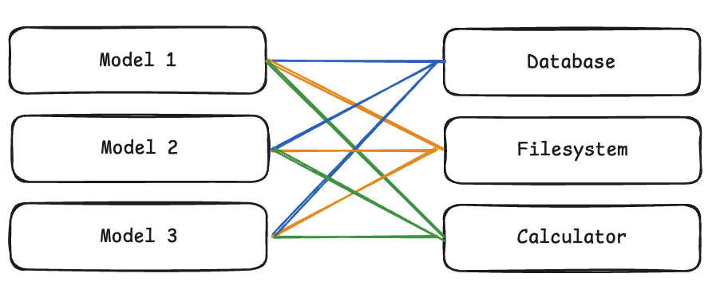

# 📚 LLM Notes

[(This notes are based on "LLM Course" by Hugging Face)](https://huggingface.co/learn/llm-course/en)

## 📑 Table of Contents

### Chapter 1. Transformer models

- [Natural Language Processing and Large Language Models](#natural-language-processing-and-large-language-models)
  - [What is NLP?](#what-is-nlp)
  - [Large Language Models (LLMs)](#large-language-models-llms)
  - [Limitations of LLMs](#limitations-of-llms)
  - [Challenges in Language Processing](#challenges-in-language-processing)
- [Transformers, what can they do?](#transformers-what-can-they-do)
  - [Capabilities](#capabilities)
  - [Pipeline Function](#pipeline-function)
  - [Modalities](#modalities)
- [How do Transformers work?](#how-do-transformers-work)
  - [History](#history)
  - [Transformer Architecture](#transformer-architecture)
  - [Attention Mechanism](#attention-mechanism)
  - [Transfer Learning](#transfer-learning)
- [Solving Tasks with Transformers](#solving-tasks-with-transformers)
  - [General Task-Solving Pattern](#general-task-solving-pattern)
  - [Language Model Training Approaches](#language-model-training-approaches)
  - [Text Tasks](#text-tasks)
  - [Speech and Audio Tasks](#speech-and-audio-tasks)
  - [Computer Vision Tasks](#computer-vision-tasks)
- [Inference with LLMs](#inference-with-llms)
  - [Understanding the Basics](#understanding-the-basics)
  - [The Role of Attention](#the-role-of-attention)
  - [Context Length and Attention Span](#context-length-and-attention-span)
  - [The Two-Phase Inference Process](#the-two-phase-inference-process)
  - [Sampling Strategies](#sampling-strategies)
  - [Practical Challenges and Optimization](#practical-challenges-and-optimization)
- [Bias and Limitations](#bias-and-limitations)
  - [Sources of Bias](#sources-of-bias)
  - [Examples of Bias in Practice](#examples-of-bias-in-practice)
  - [Implications for Production Use](#implications-for-production-use)
- [Summary](#summary)
  - [Key Concepts Covered](#key-concepts-covered)
  - [Model Architectures and Applications](#model-architectures-and-applications)
  - [Looking Ahead](#looking-ahead)

### Chapter 2. Reasoning models

- [Reinforcement Learning on LLMs](#reinforcement-learning-on-llms)
  - [What is Reinforcement Learning?](#what-is-reinforcement-learning)
  - [Key RL Components](#key-rl-components)
  - [The RL Process](#the-rl-process)
  - [Role of RL in LLMs](#role-of-rl-in-llms)
  - [Reinforcement Learning from Human Feedback (RLHF)](#reinforcement-learning-from-human-feedback-rlhf)
  - [Group Relative Policy Optimization (GRPO)](#group-relative-policy-optimization-grpo)
- [Understanding the DeepSeek R1 Paper](#understanding-the-deepseek-r1-paper)
  - [DeepSeek R1 Overview](#deepseek-r1-overview)
  - [The Breakthrough 'Aha' Moment](#the-breakthrough-aha-moment)
  - [The Training Process](#the-training-process)
  - [GRPO Algorithm Deep Dive](#grpo-algorithm-deep-dive)
  - [Limitations and Challenges](#limitations-and-challenges)
  - [Advanced GRPO Technical Analysis](#advanced-grpo-technical-analysis)
    - [GRPO Algorithm Details](#grpo-algorithm-details)
    - [Mathematical Formulations](#mathematical-formulations)
    - [Worked Example](#worked-example)
- [Summary](#summary-1)
  - [Key Concepts Covered](#key-concepts-covered-1)
  - [Technical Innovations and Breakthroughs](#technical-innovations-and-breakthroughs)
  - [Practical Applications](#practical-applications-1)
  - [Looking Ahead](#looking-ahead-1)

### Chapter 3. Model Context Protocol (MCP)

- [Key Concepts and Terminology](#key-concepts-and-terminology)
  - [The Integration Problem](#the-integration-problem)
  - [Core MCP Terminology](#core-mcp-terminology)
  - [Components](#components)
  - [Capabilities](#capabilities)
- [Architectural Components of MCP](#architectural-components-of-mcp)
  - [Host, Client, and Server](#host-client-and-server)
  - [Communication Flow](#communication-flow)
  - [Key Advantages](#key-advantages)
- [The Communication Protocol](#the-communication-protocol)
  - [JSON-RPC: The Foundation](#json-rpc-the-foundation)
  - [Message Types](#message-types)
  - [Transport Mechanisms](#transport-mechanisms)
  - [The Interaction Lifecycle](#the-interaction-lifecycle)
  - [Protocol Evolution](#protocol-evolution)
- [Understanding MCP Capabilities](#understanding-mcp-capabilities)
  - [Tools](#tools)
  - [Resources](#resources)
  - [Prompts](#prompts)
  - [Sampling](#sampling)
  - [How Capabilities Work Together](#how-capabilities-work-together)
  - [Discovery Process](#discovery-process)
- [MCP SDK](#mcp-sdk)
  - [SDK Overview](#sdk-overview)
- [MCP Clients](#mcp-clients)
    - [User Interface Clients](#user-interface-clients)
    - [Chat Interface Clients](#chat-interface-clients)
    - [Interactive Development Clients](#interactive-development-clients)
    - [Client Implementation](#client-implementation)
    - [Key Responsibilities](#key-responsibilities)
- [Chapter Summary](#chapter-summary)
  - [Overview](#overview)
  - [Key Concepts](#key-concepts)
  - [Components](#components)
  - [Capabilities](#capabilities)
  - [Communication Protocol](#communication-protocol)
  - [Discovery Process](#discovery-process)
  - [MCP SDKs](#mcp-sdks)

# Natural Language Processing and Large Language Models

## What is NLP?

NLP is a field combining linguistics and machine learning to understand human language in context. Common NLP tasks include:

- Sentence classification (sentiment analysis, spam detection)
- Word-level classification (part-of-speech tagging, named entity recognition)
- Text generation
- Question answering
- Translation and summarization

## Large Language Models (LLMs)

LLMs have revolutionized NLP with models like GPT and Llama. Key characteristics:

- Massive scale (billions of parameters)
- General capabilities across multiple tasks
- In-context learning from examples in prompts
- Emergent abilities not explicitly programmed

## Limitations of LLMs

- Hallucinations (generating incorrect information)
- Lack of true understanding
- Bias from training data
- Limited context windows
- High computational requirements

## Challenges in Language Processing

Text processing for machines differs from human understanding. Computers struggle with:

- Ambiguity
- Cultural context
- Sarcasm and humor
- Semantic understanding

# Transformers, what can they do?

## Capabilities

Transformer models can solve tasks across multiple modalities, including:

- Natural language processing
- Computer vision
- Audio processing
- Multimodal applications

## Pipeline Function

The `pipeline()` function in the 🤗 Transformers library connects a model with preprocessing and postprocessing steps:

1. Text is preprocessed into model-compatible format
2. Preprocessed inputs are passed to the model
3. Model predictions are post-processed for human interpretation

## Modalities

### Text Pipelines

- **Text generation**: Create content from prompts
- **Text classification**: Categorize text (including zero-shot)
- **Summarization**: Condense text while preserving key information
- **Translation**: Convert between languages
- **Named entity recognition**: Identify persons, locations, organizations
- **Question answering**: Extract answers from context
- **Fill-mask**: Complete sentences with missing words

### Image Pipelines

- **Image-to-text**: Generate descriptions of images
- **Image classification**: Identify objects in images
- **Object detection**: Locate and identify objects

### Audio Pipelines

- **Speech recognition**: Convert speech to text
- **Audio classification**: Categorize audio
- **Text-to-speech**: Convert text to spoken audio

### Multimodal Pipelines

- **Image-text-to-text**: Respond to images based on text prompts

# How do Transformers work?

## History

- **June 2017**: Original Transformer architecture introduced, focused on translation
- **June 2018**: GPT, first pretrained Transformer model
- **October 2018**: BERT, optimized for sentence understanding
- **February 2019**: GPT-2, larger version with better capabilities
- **October 2019**: T5, multi-task sequence-to-sequence model
- **May 2020**: GPT-3, capable of zero-shot learning
- **January 2022**: InstructGPT, trained to follow instructions
- **January 2023**: Llama, multilingual text generation
- **March 2023**: Mistral, efficient 7B model with grouped-query attention
- **May 2024**: Gemma 2, lightweight open models (2B-27B)
- **November 2024**: SmolLM2, compact models (135M-1.7B) for edge devices

## Transformer Architecture

Transformer models generally have two main components:

1. **Encoder**: Processes input to build representation/understanding
2. **Decoder**: Uses encoder's representation to generate output


These components can be used in three primary architectures:

- **Encoder-only models** (like BERT): Good for understanding tasks (classification, NER)
- **Decoder-only models** (like GPT): Good for generative tasks (text generation)
- **Encoder-decoder models** (like T5): Good for tasks requiring both input understanding and output generation (translation, summarization)

## Attention Mechanism

The core innovation of Transformers is the attention mechanism:

- Allows the model to focus on specific words when processing each word
- Captures contextual relationships between words regardless of their distance
- Different types: self-attention, masked attention (can't see future words), cross-attention (between encoder and decoder)

For example, in translation, attention helps the model focus on relevant source words when generating each target word, accounting for grammar differences between languages.

## Transfer Learning

Transformers use a two-stage approach:

1. **Pretraining**: Initial training on massive text datasets (expensive)

   - Models learn language statistics and patterns
   - Requires weeks of training on specialized hardware
   - Significant computational and environmental cost

2. **Fine-tuning**: Adapting pretrained models to specific tasks (efficient)
   - Requires much less data than training from scratch
   - Lower time, financial, and environmental costs
   - Achieves better results than training from scratch

This approach allows knowledge transfer from general language understanding to specific applications, making powerful NLP accessible to more users.

# Solving Tasks with Transformers

## General Task-Solving Pattern

Most Transformer tasks follow a consistent pattern:

1. **Input Processing**: Data is preprocessed into model-compatible format
2. **Model Processing**: Processed input passes through the model architecture
3. **Output Interpretation**: Model output is post-processed for specific tasks

The differences lie in data preparation, architectural variants, and output processing methods.

## Language Model Training Approaches

### Masked Language Modeling (MLM)

- Used by **encoder models** (like BERT)
- Randomly masks tokens and predicts original tokens from context
- Enables **bidirectional context** learning
- Best for understanding tasks

### Causal Language Modeling (CLM)

- Used by **decoder models** (like GPT)
- Predicts next token based on previous tokens
- Uses only **left-to-right context**
- Best for text generation tasks

## Text Tasks

### Text Generation (GPT-2)

- **Architecture**: Decoder-only model
- **Tokenization**: Byte Pair Encoding (BPE)
- **Key Feature**: Masked self-attention (can't see future tokens)
- **Training**: Causal language modeling objective
- **Use Cases**: Text completion, creative writing, code generation


### Text Classification (BERT)

- **Architecture**: Encoder-only model with bidirectional attention
- **Key Tokens**: `[CLS]` for classification, `[SEP]` for sentence separation
- **Training**: Masked language modeling + next-sentence prediction
- **Output**: Classification head uses `[CLS]` token representation
- **Use Cases**: Sentiment analysis, spam detection, topic classification

### Token Classification (BERT-based)

- **Task**: Assign labels to individual tokens
- **Architecture**: BERT + token classification head
- **Output**: Linear transformation of hidden states to token labels
- **Use Cases**: Named Entity Recognition (NER), Part-of-Speech tagging

### Question Answering (BERT-based)

- **Task**: Find answer spans within given context
- **Architecture**: BERT + span classification head
- **Output**: Start and end positions of answer span
- **Training**: Cross-entropy loss on span positions

### Summarization (BART/T5)

- **Architecture**: Encoder-decoder models
- **BART Pretraining**: Text infilling with corruption and reconstruction
- **Process**: Encoder understands input, decoder generates summary
- **Training**: Sequence-to-sequence loss


### Translation (BART/T5)

- **Architecture**: Encoder-decoder with language-specific adaptations
- **BART Approach**: Additional encoder for source language mapping
- **Training**: Two-stage process (source encoder, then full model)
- **Multilingual**: mBART extends to multiple languages

## Speech and Audio Tasks

### Automatic Speech Recognition (Whisper)

- **Architecture**: Encoder-decoder (sequence-to-sequence)
- **Input Processing**: Raw audio → Log-Mel spectrogram
- **Training Data**: 680,000 hours of labeled audio
- **Key Innovation**: Large-scale, weakly supervised pretraining
- **Capabilities**: Zero-shot performance across languages
- **Special Tokens**: Control transcription, translation, language identification


## Computer Vision Tasks

### Image Classification

#### Vision Transformer (ViT)

- **Architecture**: Pure Transformer (no convolutions)
- **Input Processing**: Images split into non-overlapping patches
- **Tokenization**: Patches converted to embeddings (like text tokens)
- **Key Elements**:
  - [CLS] token for classification (similar to BERT)
  - Positional embeddings for patch order
  - Transformer encoder processing
- **Output**: MLP head converts [CLS] representation to class logits


#### ConvNeXT

- **Architecture**: Modern CNN with Transformer-inspired designs
- **Approach**: Convolutional layers with contemporary network architecture
- **Use Case**: Alternative to ViT for image classification

### Other Vision Tasks

- **Object Detection**: DETR (Detection Transformer)
- **Image Segmentation**: Mask2Former
- **Depth Estimation**: GLPN (Global-Local Path Networks)

## Key Insights

1. **Architectural Flexibility**: Same core Transformer can solve diverse tasks with different heads
2. **Transfer Learning**: Pretrained models easily adapt to specific tasks
3. **Modality Agnostic**: Transformers work across text, audio, and vision
4. **Task-Specific Heads**: Simple linear layers adapt pretrained representations
5. **Pattern Recognition**: Similar approaches across different domains (tokenization, attention, classification heads)

# Inference with LLMs

## Understanding the Basics

**Inference** is the process of using a trained LLM to generate human-like text from a given input prompt. Key characteristics:

- **Sequential Generation**: Models generate text one token at a time
- **Autoregressive Process**: Each new token depends on all previous tokens
- **Probability-based**: Uses learned probabilities from billions of parameters
- **Context-aware**: Leverages understanding from training data

## The Role of Attention

The attention mechanism enables LLMs to focus on relevant information when predicting the next token.


### How Attention Works

- **Selective Focus**: Not every word carries equal weight in prediction
- **Context Understanding**: Identifies crucial words for next token prediction
- **Example**: In "The capital of France is...", words "France" and "capital" are most relevant for predicting "Paris"

### Impact on Modern LLMs

- **Coherent Generation**: Produces contextually relevant text
- **Long-range Dependencies**: Handles relationships across long sequences
- **Scalability**: Enables processing of increasingly longer sequences at lower costs

## Context Length and Attention Span

**Context Length**: Maximum number of tokens an LLM can process simultaneously

### Limitations

- **Model Architecture**: Size and design constraints
- **Computational Resources**: Hardware and memory limitations
- **Processing Complexity**: Quadratic growth in memory usage
- **Cost Efficiency**: Balance between capability and practical deployment

### Trade-offs

- **Longer Context**: More information but slower processing
- **Shorter Context**: Faster processing but limited understanding
- **Memory Usage**: Grows quadratically with context length

## The Two-Phase Inference Process

### Prefill Phase

**Purpose**: Initial processing and context understanding

**Steps**:

1. **Tokenization**: Convert input text to tokens
2. **Embedding Conversion**: Transform tokens to numerical representations
3. **Initial Processing**: Create rich context understanding through neural networks

**Characteristics**:

- **Computationally Intensive**: Processes all input tokens simultaneously
- **Parallel Processing**: Can process multiple tokens at once
- **Foundation**: Sets up context for generation

### Decode Phase

**Purpose**: Actual text generation through autoregressive process

**Steps**:

1. **Attention Computation**: Analyze relationships with previous tokens
2. **Probability Calculation**: Determine likelihood of each possible next token
3. **Token Selection**: Choose next token based on probabilities
4. **Continuation Check**: Decide whether to continue or stop generation

**Characteristics**:

- **Memory Intensive**: Must track all previously generated tokens
- **Sequential**: Generates one token at a time
- **Context Dependent**: Each token depends on all previous tokens

## Sampling Strategies

### Token Selection Process


**Process Flow**:

1. **Raw Logits**: Initial probability scores for all vocabulary tokens
2. **Temperature Control**: Adjust creativity vs. determinism
3. **Filtering**: Apply top-p or top-k constraints
4. **Selection**: Choose final token

### Temperature Control

- **High Temperature (>1.0)**: More random and creative output
- **Low Temperature (<1.0)**: More focused and deterministic output
- **Temperature = 1.0**: Unchanged probability distribution

### Top-p (Nucleus) Sampling

- **Concept**: Consider only tokens contributing to cumulative probability threshold
- **Example**: Top-90% includes most likely tokens summing to 90% probability
- **Benefit**: Dynamic vocabulary size based on context

### Top-k Filtering

- **Concept**: Consider only k most likely tokens
- **Example**: Top-5 considers only 5 most probable next tokens
- **Benefit**: Fixed vocabulary size for consistent behavior

### Managing Repetition

**Presence Penalty**:

- Fixed penalty for any previously used token
- Prevents immediate repetition

**Frequency Penalty**:

- Scaling penalty based on token usage frequency
- Stronger penalty for frequently used tokens

### Controlling Generation Length

**Methods**:

- **Token Limits**: Set minimum/maximum token counts
- **Stop Sequences**: Define patterns that end generation
- **End-of-Sequence Detection**: Let model naturally conclude

### Beam Search

**Concept**: Explore multiple generation paths simultaneously

**Process**:

1. Maintain multiple candidate sequences (5-10 beams)
2. Compute probabilities for next token in each sequence
3. Keep most promising sequence-token combinations
4. Continue until completion
5. Select sequence with highest overall probability

**Benefits**:

- More coherent and grammatically correct text
- Considers multiple possibilities before committing

**Trade-offs**:

- Higher computational cost
- More memory intensive

## Practical Challenges and Optimization

### Key Performance Metrics

**Time to First Token (TTFT)**:

- How quickly first response appears
- Primarily affected by prefill phase
- Critical for user experience

**Time Per Output Token (TPOT)**:

- Speed of subsequent token generation
- Determines overall generation speed
- Affected by decode phase efficiency

**Throughput**:

- Number of simultaneous requests handled
- Affects scaling and cost efficiency
- Important for production deployment

**VRAM Usage**:

- GPU memory requirements
- Often the primary deployment constraint
- Grows with model size and context length

### Context Length Challenge

**Memory Growth**: Quadratic relationship with context length
**Processing Speed**: Linear decrease with longer contexts
**Resource Allocation**: Careful VRAM usage balancing

**Example Models**:

- **Standard Models**: 4K-8K token contexts
- **Extended Models**: Qwen2.5-1M with 1M token context
- **Trade-off**: Longer context = slower inference

### KV Cache Optimization

**Key-Value Caching**: Store and reuse intermediate calculations

**Benefits**:

- Reduces repeated computations
- Improves generation speed
- Makes long-context generation practical

**Trade-offs**:

- Additional memory usage
- Complexity in implementation
- Usually worthwhile for performance gains

# Bias and Limitations

## Sources of Bias

### Training Data Origins

- **Web Scraping**: Models trained on massive internet datasets
- **Unfiltered Content**: Includes both high-quality and problematic content
- **Societal Biases**: Reflects existing prejudices and stereotypes from training data
- **Scale vs. Quality Trade-off**: Large datasets prioritize quantity over content curation

### Even "Neutral" Datasets Contain Bias

- **Example**: BERT trained on Wikipedia and BookCorpus
- **Perception vs. Reality**: Seemingly neutral sources still reflect societal biases
- **Historical Bias**: Past content reflects historical prejudices and stereotypes
- **Implicit Associations**: Subtle biases embedded in language patterns

## Examples of Bias in Practice

### Gender Bias in Occupations

**BERT Fill-Mask Example**:

**Input**: "This man works as a [MASK]."
**Output**: lawyer, carpenter, doctor, waiter, mechanic

**Input**: "This woman works as a [MASK]."
**Output**: nurse, waitress, teacher, maid, prostitute

### Analysis of Bias

- **Gender Stereotyping**: Occupations associated with traditional gender roles
- **Limited Gender-Neutral Options**: Only waiter/waitress appears in both lists
- **Problematic Associations**: Inappropriate career suggestions for women
- **Systemic Pattern**: Reflects broader societal prejudices in language data

## Implications for Production Use

### Critical Awareness Required

- **Not Just Technical**: Models carry social and ethical implications
- **Production Responsibility**: Developers must consider bias impact
- **User Impact**: Biased outputs can harm users and perpetuate stereotypes
- **Regulatory Considerations**: Bias can lead to legal and compliance issues

### Limitations of Current Solutions

**Fine-tuning Limitations**:

- **Surface-level Changes**: Fine-tuning doesn't eliminate underlying bias
- **Intrinsic Bias Persistence**: Core model biases remain embedded
- **Data Dependency**: Fine-tuning data may introduce additional biases
- **Incomplete Solution**: Requires comprehensive bias mitigation strategies

### Mitigation Strategies

**During Development**:

- **Bias Testing**: Systematic evaluation for various forms of bias
- **Diverse Teams**: Include diverse perspectives in development
- **Ethical Guidelines**: Establish clear bias mitigation protocols
- **Continuous Monitoring**: Ongoing assessment of model outputs

**During Deployment**:

- **Output Filtering**: Post-processing to catch problematic outputs
- **User Education**: Clear communication about model limitations
- **Feedback Mechanisms**: Allow users to report biased outputs
- **Regular Audits**: Periodic bias assessment and model updates

**Best Practices**:

- **Transparency**: Document known biases and limitations
- **Context Consideration**: Understand use case implications
- **Alternative Models**: Consider multiple models for critical applications
- **Human Oversight**: Maintain human review for sensitive applications

# Summary

In this chapter, you've been introduced to the fundamentals of Transformer models, Large Language Models (LLMs), and how they're revolutionizing AI and beyond.

## Key Concepts Covered

### Natural Language Processing and LLMs

We explored what NLP is and how Large Language Models have transformed the field. You learned that:

- **NLP encompasses a wide range of tasks** from classification to generation
- **LLMs are powerful models** trained on massive amounts of text data
- **These models can perform multiple tasks** within a single architecture
- **Despite their capabilities**, LLMs have limitations including hallucinations and bias

### Transformer Capabilities

You saw how the `pipeline()` function from 🤗 Transformers makes it easy to use pre-trained models for various tasks:

- **Text processing**: Classification, token classification, and question answering
- **Text generation**: Generation and summarization
- **Translation**: Sequence-to-sequence tasks
- **Multimodal**: Speech recognition and image classification

### Transformer Architecture

We discussed how Transformer models work at a high level, including:

- **The importance of the attention mechanism**
- **How transfer learning** enables models to adapt to specific tasks
- **The three main architectural variants**: encoder-only, decoder-only, and encoder-decoder

## Model Architectures and Applications

A key aspect of this chapter was understanding which architecture to use for different tasks:

| Model               | Examples                     | Tasks                                                                            |
| ------------------- | ---------------------------- | -------------------------------------------------------------------------------- |
| **Encoder-only**    | BERT, DistilBERT, ModernBERT | Sentence classification, named entity recognition, extractive question answering |
| **Decoder-only**    | GPT, LLaMA, Gemma, SmolLM    | Text generation, conversational AI, creative writing                             |
| **Encoder-decoder** | BART, T5, Marian, mBART      | Summarization, translation, generative question answering                        |

### Modern LLM Developments

You also learned about recent developments in the field:

- **How LLMs have grown** in size and capability over time
- **The concept of scaling laws** and how they guide model development
- **Specialized attention mechanisms** that help models process longer sequences
- **The two-phase training approach** of pretraining and instruction tuning

### Practical Applications

Throughout the chapter, you've seen how these models can be applied to real-world problems:

- **Using the Hugging Face Hub** to find and use pre-trained models
- **Leveraging the Inference API** to test models directly in your browser
- **Understanding which models** are best suited for specific tasks

## Looking Ahead

Now that you have a solid understanding of what Transformer models are and how they work at a high level, you're ready to dive deeper into how to use them effectively. In the next chapters, you'll learn how to:

- **Use the Transformers library** to load and fine-tune models
- **Process different types of data** for model input
- **Adapt pre-trained models** to your specific tasks
- **Deploy models** for practical applications

The foundation you've built in this chapter will serve you well as you explore more advanced topics and techniques in the coming sections.

### Key Takeaways

1. **Transformers are versatile**: Single architecture handles multiple modalities and tasks
2. **Architecture matters**: Choose encoder-only, decoder-only, or encoder-decoder based on task
3. **Attention is fundamental**: Enables context understanding and coherent generation
4. **Transfer learning is powerful**: Pretrained models adapt efficiently to specific tasks
5. **Bias awareness is critical**: All models inherit biases from training data
6. **Practical considerations**: Performance, memory, and ethical implications matter
7. **Continuous evolution**: Field rapidly advancing with new techniques and optimizations

# Reinforcement Learning on LLMs

## What is Reinforcement Learning?

**Reinforcement Learning (RL)** is a machine learning approach where an agent learns to make decisions through trial and error, receiving feedback in the form of rewards or penalties.

### Simple Analogy

Training a dog to sit:

- **Command**: "Sit!"
- **Action**: Dog sits or doesn't sit
- **Reward**: Treat and praise for sitting
- **Learning**: Dog associates sitting with positive outcomes


## Key RL Components

### Agent

- **Definition**: The learner making decisions
- **In LLMs**: The language model itself
- **Role**: Makes choices and learns from environment feedback

### Environment

- **Definition**: The world the agent interacts with
- **In LLMs**: Users, simulated scenarios, or evaluation systems
- **Role**: Provides context and feedback to the agent

### Action

- **Definition**: Choices the agent can make
- **In LLMs**:
  - Generating words in sentences
  - Choosing answers to questions
  - Deciding conversation responses

### Reward

- **Definition**: Feedback signal from environment
- **Types**:
  - **Positive rewards**: "Good job!" signals
  - **Negative rewards**: "Try something else" signals
- **In LLMs**: Scores for helpfulness, truthfulness, harmlessness

### Policy

- **Definition**: Agent's strategy for choosing actions
- **Evolution**: Starts random, improves through learning
- **Goal**: Maximize cumulative reward over time

## The RL Process


The RL process follows a continuous cycle of trial and error:

| Step               | Process                            | Description                                               |
| ------------------ | ---------------------------------- | --------------------------------------------------------- |
| 1. **Observation** | Agent observes environment         | Takes in information about current state and surroundings |
| 2. **Action**      | Agent takes action based on policy | Uses learned strategy to decide what to do next           |
| 3. **Feedback**    | Environment provides reward        | Agent receives feedback on action quality                 |
| 4. **Learning**    | Agent updates policy               | Adjusts strategy based on reward received                 |
| 5. **Iteration**   | Repeat the process                 | Continuous cycle for ongoing improvement                  |

### Learning Through Experience

Like learning to ride a bike:

- **Initial attempts**: Wobbling and falling (negative reward)
- **Success moments**: Balancing and smooth pedaling (positive reward)
- **Adaptation**: Adjusting actions based on feedback
- **Mastery**: Developing consistent riding skills

## Role of RL in LLMs

### Limitations of Traditional Training

**Pre-training challenges**:

- Models excel at next-word prediction
- Generate fluent, grammatically correct text
- **But lack**: Helpfulness, harmlessness, human alignment

**Supervised fine-tuning limitations**:

- Produces structured outputs
- May generate factually incorrect content
- Doesn't guarantee helpful or aligned responses

### RL Solutions for LLMs

**Enhanced capabilities through RL**:

- **Helpfulness**: Provide useful and relevant information
- **Harmlessness**: Avoid toxic, biased, or harmful content
- **Human Alignment**: Respond naturally and engagingly

**Benefits of RL in LLMs**:

| Benefit                   | Description                                                              |
| ------------------------- | ------------------------------------------------------------------------ |
| **Improved Control**      | Guide text generation toward specific goals (helpful, creative, concise) |
| **Human Value Alignment** | Learn from human judgments and preferences                               |
| **Behavior Mitigation**   | Reduce toxic language, misinformation, and biases                        |

## Reinforcement Learning from Human Feedback (RLHF)

**RLHF** uses human feedback as the reward signal to align language models with human preferences.


### RLHF Process

#### 1. Collect Human Preferences

- **Method**: Compare different LLM responses to same prompt
- **Example**: "Which answer to 'What is the capital of France?' is better?"
- **Data**: Human preference rankings and comparisons

#### 2. Train Reward Model

- **Purpose**: Learn to predict human preferences
- **Training**: Use human preference data
- **Function**: Score responses based on helpfulness, harmlessness, alignment

#### 3. Fine-tune LLM with RL

- **Setup**: Reward model acts as environment
- **Process**:
  - LLM generates responses (actions)
  - Reward model scores responses (provides rewards)
  - LLM learns to produce higher-scoring text

### RLHF Success Stories

**Popular models using RLHF**:

- **OpenAI GPT-4**: Advanced conversational AI
- **Google Gemini**: Multimodal reasoning model
- **DeepSeek R1**: Specialized reasoning model

## Group Relative Policy Optimization (GRPO)

### Why GRPO?

**GRPO** represents a significant advancement in RLHF techniques, offering improvements over existing methods.

### Comparison with Other Methods

#### Proximal Policy Optimization (PPO)

- **Approach**: Policy gradient method with separate reward model
- **Characteristics**: First highly effective RLHF technique
- **Complexity**: Requires careful hyperparameter tuning

#### Direct Preference Optimization (DPO)

- **Approach**: Eliminates separate reward model
- **Method**: Uses preference data directly as classification task
- **Simplification**: Frames problem as chosen vs. rejected responses

### GRPO Advantages

#### Group-Based Approach

- **Method**: Groups similar samples together for comparison
- **Benefits**:
  - More stable gradients
  - Better convergence properties
  - Reduced variance in training

#### Flexible Reward Sources

**GRPO doesn't require preference data** and can use various reward signals:

| Reward Source           | Application             | Example                                  |
| ----------------------- | ----------------------- | ---------------------------------------- |
| **Length Function**     | Control response length | Reward shorter, more concise answers     |
| **Mathematical Solver** | Verify correctness      | Check solution accuracy in math problems |
| **Factual Checker**     | Ensure accuracy         | Reward factually correct information     |
| **Reward Model**        | General alignment       | Traditional RLHF approach                |

#### Versatility

- **Adaptable**: Works across different alignment tasks
- **Flexible**: Can incorporate multiple reward signals
- **Efficient**: Better training stability than alternatives

### GRPO Process

1. **Sample Grouping**: Collect similar samples for comparison
2. **Group Evaluation**: Apply reward function to sample groups
3. **Relative Optimization**: Update policy based on group-relative performance
4. **Iterative Improvement**: Repeat process for continuous enhancement

# Understanding the DeepSeek R1 Paper

DeepSeek R1 represents a significant advancement in language model training, particularly in developing reasoning capabilities through reinforcement learning. The paper introduces a breakthrough reinforcement learning algorithm called **Group Relative Policy Optimization (GRPO)**.

## DeepSeek R1 Overview

### Research Goal

The initial goal was to explore whether **pure reinforcement learning** could develop reasoning capabilities without supervised fine-tuning - a departure from traditional LLM training approaches.

### Key Innovation

- **Pure RL Approach**: Challenged the assumption that supervised fine-tuning was necessary
- **GRPO Algorithm**: New method for more efficient and stable RL training
- **Emergent Reasoning**: Natural development of reasoning capabilities through RL

### Two Model Variants

| Feature                  | DeepSeek-R1-Zero                        | DeepSeek-R1                                 |
| ------------------------ | --------------------------------------- | ------------------------------------------- |
| **Training Approach**    | Pure RL                                 | Multi-phase (SFT + RL)                      |
| **Fine-tuning**          | None                                    | Supervised fine-tuning                      |
| **Reasoning Capability** | Emergent                                | Enhanced                                    |
| **AIME Performance**     | 71.0%                                   | 79.8%                                       |
| **Key Characteristics**  | Strong reasoning but readability issues | Better language consistency and readability |

## The Breakthrough 'Aha' Moment


### What is the 'Aha' Moment?

One of the most remarkable discoveries in R1-Zero's training was the emergence of the **"Aha Moment"** - similar to human sudden realizations during problem-solving.

### The Process

1. **Initial Attempt**: Model makes first attempt at solving a problem
2. **Recognition**: Recognizes potential errors or inconsistencies
3. **Self-Correction**: Adjusts approach based on recognition
4. **Explanation**: Can explain why the new approach is better

### Human-like Example

**Puzzle Solving Process**:

- **First try**: "This piece should go here based on the color"
- **Recognition**: "But wait, the shape doesn't quite fit"
- **Correction**: "Ah, it actually belongs over there"
- **Explanation**: "Because both the color and shape pattern match in this position"

### Significance

- **Emergent Behavior**: Arose naturally from RL training without explicit programming
- **True Learning**: Demonstrates learning rather than mere memorization
- **Reasoning Development**: Shows genuine problem-solving capability evolution

## The Training Process

The training process involves **four distinct phases**, each building upon the previous one:

### Phase 1: Cold Start Phase (Quality Foundation)

**Purpose**: Establish strong foundation for readability and response quality

**Process**:

- Start with DeepSeek-V3-Base model
- Use thousands of high-quality samples from R1-Zero
- Supervised fine-tuning with small but high-quality dataset
- Focus on baseline readability and response quality

### Phase 2: Reasoning RL Phase (Capability Building)

**Purpose**: Develop core reasoning capabilities across multiple domains

**Key Features**:

- **Domains**: Mathematics, coding, science, and logic
- **Rule-based RL**: Rewards directly tied to solution correctness
- **Verifiable Tasks**: All tasks can be objectively evaluated
- **Direct Optimization**: Eliminates need for separate reward model

**Innovation**: Streamlined training process with direct correctness verification

### Phase 3: Rejection Sampling Phase (Quality Control)

**Purpose**: Filter and refine model outputs through quality control

**Process**:

1. Model generates multiple samples
2. DeepSeek-V3 serves as quality judge
3. Evaluation across broad scope beyond pure reasoning
4. Filtered data used for supervised fine-tuning

**Innovation**: Combines multiple quality signals for high-standard outputs

### Phase 4: Diverse RL Phase (Broad Alignment)

**Purpose**: Achieve human preference alignment across multiple task types

**Hybrid Approach**:

- **Deterministic Tasks**: Rule-based rewards
- **Subjective Tasks**: LLM feedback evaluation
- **Human Alignment**: Combines precision with flexibility

## GRPO Algorithm Deep Dive

### Core Innovation

GRPO's breakthrough lies in its capacity to **"directly optimize for preference rectification"** - a more direct and efficient route compared to traditional RL algorithms like PPO.

### Three Main Components

#### 1. Group Formation: Creating Multiple Solutions


**Process**:

- Generate multiple attempts (4, 8, or 16) for same problem
- Similar to student trying multiple approaches
- Keep all attempts together as a group for comparison

**Example - Math Problem**:

- **Solution 1**: Step-by-step breakdown (count total → subtract roosters → account for non-laying)
- **Solution 2**: Alternative but equally valid approach
- **Solution 3**: Contains mistakes or less efficient methods
- **All solutions**: Kept together for comparative learning

#### 2. Preference Learning: Understanding Quality


**Key Advantages**:

- **Flexible Evaluation**: Can use any function or model for quality assessment
- **No Separate Reward Model**: Unlike traditional RLHF methods
- **Multiple Quality Signals**: Length, accuracy, formatting, reasoning consistency

**Group Relative Advantage Formula**:

$$ A*i = \frac{r_i - \text{mean}(r*{1:G})}{\text{std}(r\_{1:G})} $$

**Benefits**:

- **Normalized Scoring**: Like grading on a curve for AI
- **Relative Comparison**: Understands which solutions are better within group
- **Stability**: Prevents issues with reward scaling

#### 3. Optimization: Learning from Experience

**Two Main Principles**:

1. **Encouragement**: Produce more solutions like successful ones
2. **Safety Mechanism**: KL divergence penalty prevents drastic changes

**Stability Features**:

- **Group-based Learning**: More stable than pairwise comparisons
- **Normalized Rewards**: Prevents scaling issues
- **KL Penalty**: Safety net preserving existing knowledge

## Limitations and Challenges

### Computational Challenges

**Generation Cost**:

- Requires multiple completions (4-16) per prompt
- Higher computational requirements than single-generation methods

**Batch Size Constraints**:

- Need to process groups together
- Limits effective batch sizes
- Adds training complexity

### Design Challenges

**Reward Function Design**:

- Training quality depends on well-designed reward functions
- Poorly designed rewards can lead to unintended behaviors
- Risk of optimizing for wrong objectives

**Group Size Tradeoffs**:

- Balance between solution diversity and computational cost
- Too few samples = insufficient diversity
- Too many samples = increased training time and resources

**KL Divergence Tuning**:

- Requires careful balance in KL divergence penalty
- Too high = ineffective learning
- Too low = model diverges from initial capabilities

# Advanced GRPO Technical Analysis

This section provides an in-depth technical understanding of Group Relative Policy Optimization (GRPO), including mathematical formulations and detailed algorithmic steps.


## GRPO Algorithm Details

### Core Innovation

GRPO **directly evaluates model-generated responses** by comparing them within groups of generations to optimize the policy model, instead of training a separate value model (Critic). This approach leads to **significant reduction in computational cost**.

### Applicability

GRPO can be applied to **any verifiable task** where the correctness of the response can be determined. For instance, in mathematical reasoning, correctness can be easily verified by comparing to ground truth.

### Three-Step Algorithm

#### Step 1: Group Sampling

**Purpose**: Generate multiple possible answers for each question to create diverse outputs for comparison.

**Process**:
For each question $q$, generate $G$ outputs (group size) from the trained policy:

$$ \{o_1, o_2, o_3, ..., o_G \pi_{\theta_{old}}\}, \text{ where } G = 8 $$

Each $o_i$ represents one completion from the model.

**Example**:

- **Question**: Calculate 2 + 2 × 6
- **Outputs (G=8)**:
  - $o_1: 14 \text{ (correct)}$
  - $o_2: 16 \text{ (wrong)}$
  - $o_3: 10 \text{ (wrong)}$
  - ...
  - $o_8: 14 \text{ (correct)}$

**Key Insight**: Diversity in generated answers (some correct, some wrong) is crucial for effective learning.

#### Step 2: Advantage Calculation

**Purpose**: Determine which responses are better than others within the group.

##### Reward Distribution

First, assign reward scores to each generated response:

- $r_i$ (e.g., 1 for correct response, 0 for wrong response)

##### Advantage Value Formula

The key insight: Compare outputs within the same group using standardization:

$$ A_i = \frac{r_i - \text{mean}(\{r_1, r_2, ..., r_G\})}{\text{std}(\{r_1, r_2, ..., r_G\})} $$

**Example Calculation**:

- **Group Average**: $\text{mean}(r_i) = 0.5$
- **Standard Deviation**: $\text{std}(r_i) = 0.53$
- **Advantage (Correct)**: $A_i = \frac{1-0.5}{0.53} = 0.94$
- **Advantage (Wrong)**: $A_i = \frac{0-0.5}{0.53} = -0.94$

##### Interpretation

- $A_i > 0$: Response is better than average within its group
- $A_i < 0$: Response quality is below average
- High $A_i$: Generation probability will be increased during optimization

#### Step 3: Policy Update

**Purpose**: Use advantage values to update the model for better future responses.

## Mathematical Formulations

### GRPO Target Function

The complete objective function for policy updates:

$$ J_{GRPO}(\theta) = \left[\frac{1}{G} \sum_{i=1}^G \min\left(\frac{\pi*\theta(o_i|q)}{\pi*{\theta*{old}}(o_i|q)} A_i, \text{clip}\left(\frac{\pi*\theta(o*i|q)}{\pi*{\theta*{old}}(o*i|q)}, 1-\varepsilon, 1+\varepsilon\right) A_i\right)\right] - \beta D*{KL}(\pi*\theta \| \| \pi\*{ref}) $$

### Key Components Analysis

#### 1. Probability Ratio

**Formula**: $\frac{\pi_\theta(o_i|q)}{\pi_{\theta_{old}}(o_i|q)}$

**Interpretation**:

- **Ratio > 1**: New model assigns higher probability to response $o_i$
- **Ratio < 1**: New model assigns lower probability to $o_i$
- **Purpose**: Control how much the model changes at each step

#### 2. Clip Function

**Formula**: $\text{clip}\left(\frac{\pi_\theta(o_i|q)}{\pi_{\theta_{old}}(o_i|q)}, 1-\varepsilon, 1+\varepsilon\right)$

**Purpose**: Limit ratio to be within $[1-\varepsilon, 1+\varepsilon]$ to avoid drastic changes.

**Example ($\varepsilon = 0.2$)**:

| Scenario   | Old Prob | New Prob | Ratio | Clipped Ratio     |
| ---------- | -------- | -------- | ----- | ----------------- |
| **Case 1** | 0.5      | 0.9      | 1.8   | 1.2 (upper bound) |
| **Case 2** | 0.5      | 0.2      | 0.4   | 0.8 (lower bound) |

**Benefits**:

- Encourages reinforcement of underweighted good responses
- Controls reinforcement of already favored responses
- Discourages overestimated poor responses

#### 3. KL Divergence Penalty

**Formula**: $\beta D_{KL}(\pi_\theta \|\| \pi_{ref})$

**Mathematical Definition**:

$$ D_{KL}(P\| \|Q) = \sum_{x\in X} P(x) \log\left(\frac{P(x)}{Q(x)}\right) $$

**Purpose**: Prevent model from deviating too far from original behavior.

**$\beta$ Parameter Effects**:

| $\beta$ Value | Effect              | Benefits            | Risks                 |
| ------------- | ------------------- | ------------------- | --------------------- |
| **Higher**    | Stronger constraint | Maintains coherence | Slower adaptation     |
| **Lower**     | More freedom        | Faster adaptation   | Potential instability |

**DeepSeekMath Setting**: $\beta = 0.04$

## Worked Example

### Complete GRPO Process

#### Problem

**Question**: Calculate 2 + 2 × 6

#### Step 1: Group Sampling

**Generated Responses (G=8)**:

- 4 correct answers (14, reward = 1)
- 4 incorrect answers (reward = 0)

#### Step 2: Advantage Calculation

| Statistic               | Value                              |
| ----------------------- | ---------------------------------- |
| **Group Average**       | $\text{mean}(r_i) = 0.5$           |
| **Standard Deviation**  | $\text{std}(r_i) = 0.53$           |
| **Advantage (Correct)** | $A_i = \frac{1-0.5}{0.53} = 0.94$  |
| **Advantage (Wrong)**   | $A_i = \frac{0-0.5}{0.53} = -0.94$ |

#### Step 3: Policy Update

**Scenario**: Old policy probability for correct output $o_1$ is 0.5, new policy increases to 0.7

**Calculations**:

- **Ratio**: $\frac{0.7}{0.5} = 1.4$
- **After Clipping**: 1.2 (with $\varepsilon = 0.2$)
- **Result**: Model reinforces generation of correct output
- **KL Divergence**: Limits deviation from reference policy

# Summary

In this chapter, you've explored the cutting-edge world of reinforcement learning and reasoning models, discovering how they're transforming the capabilities of Large Language Models beyond traditional training approaches.

## Key Concepts Covered

### Reinforcement Learning Fundamentals

We explored the core principles of reinforcement learning and how they apply to language models:

- **RL Components**: Agent, environment, actions, rewards, and policies working together
- **Trial-and-Error Learning**: How models learn through interaction and feedback
- **Beyond Traditional Training**: Addressing limitations of pre-training and supervised fine-tuning
- **Human Alignment**: Achieving helpfulness, harmlessness, and human preference alignment

### Reinforcement Learning from Human Feedback (RLHF)

You learned how human feedback revolutionizes model training:

- **Three-Phase Process**: Human preference collection, reward model training, and RL fine-tuning
- **Human Preference Integration**: Learning from human judgments rather than explicit rules
- **Practical Success**: Powering models like GPT-4, Gemini, and DeepSeek R1
- **Scalable Alignment**: Making human values learnable at scale

### Group Relative Policy Optimization (GRPO)

We introduced GRPO as a breakthrough advancement in RLHF techniques:

- **Group-Based Learning**: Comparing multiple solutions simultaneously for stability
- **Flexible Reward Sources**: Working with any verifiable function, not just preference data
- **Computational Efficiency**: Eliminating the need for separate reward models
- **Mathematical Foundation**: Detailed formulations and algorithmic understanding

### DeepSeek R1 Case Study

You experienced a comprehensive analysis of cutting-edge research:

- **Pure RL Exploration**: Challenging assumptions about supervised fine-tuning necessity
- **Emergent Phenomena**: The remarkable "Aha Moment" in reasoning development
- **Multi-Phase Training**: Four-stage process from cold start to diverse alignment
- **State-of-the-Art Results**: Achieving top performance across multiple benchmarks

## Technical Innovations and Breakthroughs

### Algorithmic Advances

| Innovation                | Key Feature                                  | Impact                             |
| ------------------------- | -------------------------------------------- | ---------------------------------- |
| **GRPO Algorithm**        | Group-relative advantage estimation          | More stable training than PPO/DPO  |
| **Aha Moment Phenomenon** | Emergent self-correction behavior            | True reasoning vs. memorization    |
| **Multi-Phase Training**  | Cold start → Reasoning → Rejection → Diverse | Balanced performance and usability |
| **Direct Optimization**   | No separate reward model needed              | Reduced computational complexity   |

### Mathematical Foundations

You also learned about the technical underpinnings:

- **Advantage Calculation**: $A_i = \frac{r_i - \text{mean}(r_{1:G})}{\text{std}(r_{1:G})}$ for relative comparison
- **Policy Updates**: Clipped probability ratios with KL divergence constraints
- **Stability Mechanisms**: Preventing drastic policy changes while enabling learning
- **Verifiable Tasks**: Objective evaluation functions for mathematical and logical reasoning

## Looking Ahead

With a solid understanding of reinforcement learning for reasoning models, you're prepared for advanced topics including:

- **Practical Implementation**: Hands-on experience with GRPO training
- **Custom Reward Functions**: Designing evaluation functions for specific tasks
- **Multi-Modal Reasoning**: Extending RL techniques beyond text
- **Production Deployment**: Scaling reasoning models for real-world applications

The foundation you've built in reinforcement learning and reasoning will serve as a cornerstone for understanding next-generation AI capabilities.

## Key Takeaways

1. **RL Transforms Capabilities**: Reinforcement learning addresses fundamental limitations of traditional LLM training
2. **Human Feedback is Powerful**: RLHF enables learning complex human preferences that are hard to specify explicitly
3. **GRPO Advances the Field**: Group-based optimization provides stability and efficiency over previous methods
4. **Emergent Reasoning**: Pure RL can develop genuine problem-solving capabilities like the "Aha Moment"
5. **Mathematical Rigor Matters**: Understanding the technical details enables better implementation and innovation
6. **Verifiable Tasks Excel**: RL methods work best when correctness can be objectively determined
7. **Multi-Phase Training**: Combining different approaches (RL + SFT) often yields optimal results
8. **Computational Efficiency**: Modern methods like GRPO reduce costs while improving performance
9. **Scalability Proven**: Successful distillation shows these techniques work across model sizes
10. **Future of AI**: Reasoning models represent a significant step toward more capable and aligned AI systems

# Key Concepts and Terminology

## The Integration Problem

The Model Context Protocol (MCP) is often described as the "USB-C for AI applications" - providing a standardized interface for connecting AI models to external capabilities. This standardization benefits the entire ecosystem:

- Users enjoy simpler, consistent experiences across AI applications
- AI application developers gain easy integration with tools and data sources
- Tool and data providers need only create a single implementation
- The broader ecosystem benefits from increased interoperability

### Without MCP (M×N Problem)

Without a protocol like MCP, developers face the M×N integration problem - needing to create custom integrations for each possible pairing of an AI application with an external capability.



### With MCP (M+N Solution)

MCP transforms this into an M+N problem by providing a standard interface:
- Each AI application implements the client side of MCP once
- Each tool/data source implements the server side once


## Core MCP Terminology

### Components

MCP follows a client-server architecture:

1. **Host**: The user-facing AI application (e.g., Claude Desktop, Cursor IDE)
   - Initiates connections to MCP Servers
   - Orchestrates flow between user requests, LLM processing, and tools

2. **Client**: Component within the host that manages MCP Server communication
   - Maintains 1:1 connection with a single Server
   - Handles protocol-level details
   - Acts as intermediary between Host and Server

3. **Server**: External program/service exposing capabilities via MCP protocol

### Capabilities

MCP supports four main types of capabilities:

| Capability | Description | Example |
|------------|-------------|---------|
| **Tools** | Executable functions for actions/computed data | Weather lookup function |
| **Resources** | Read-only data sources for context | Scientific papers database |
| **Prompts** | Pre-defined templates/workflows | Summarization template |
| **Sampling** | Server-initiated LLM interaction requests | Code review and refinement |


Example application capabilities:
- **Tool**: Code Interpreter for executing LLM-written code
- **Resource**: Documentation database
- **Prompt**: Code style guidelines
- **Sampling**: Code review and refinement process

# Architectural Components of MCP

The Model Context Protocol (MCP) is built on a client-server architecture that enables structured communication between AI models and external systems.

## Host, Client, and Server

The MCP architecture consists of three primary components, each with well-defined roles and responsibilities:


### Host

The Host is the user-facing AI application that end-users interact with directly.

**Examples include:**
- AI Chat apps (OpenAI ChatGPT, Anthropic's Claude Desktop)
- AI-enhanced IDEs (Cursor, Continue.dev)
- Custom AI agents (LangChain, smolagents)

**Responsibilities:**
- Managing user interactions and permissions
- Initiating connections to MCP Servers via MCP Clients
- Orchestrating flow between user requests, LLM processing, and tools
- Rendering results back to users

### Client

The Client is a component within the Host application that manages communication with a specific MCP Server.

**Key characteristics:**
- Maintains 1:1 connection with a single Server
- Handles protocol-level details of MCP communication
- Acts as intermediary between Host's logic and external Server

### Server

The Server is an external program or service that exposes capabilities to AI models via the MCP protocol.

**Characteristics:**
- Provides access to specific external tools, data sources, or services
- Acts as lightweight wrappers around existing functionality
- Can run locally or remotely
- Exposes capabilities in standardized format

## Communication Flow

The components interact in a typical MCP workflow:

1. **User Interaction**: User interacts with Host application
2. **Host Processing**: Host processes input using LLM
3. **Client Connection**: Host directs Client to connect to Server(s)
4. **Capability Discovery**: Client queries Server for available capabilities
5. **Capability Invocation**: Host instructs Client to invoke specific capabilities
6. **Server Execution**: Server executes functionality and returns results
7. **Result Integration**: Client relays results back to Host

### Key Advantages

- **Modularity**: Single Host can connect to multiple Servers
- **Extensibility**: New Servers can be added without changing existing Hosts
- **Composability**: Capabilities can be composed across different Servers
- **Standardization**: Universal protocol for AI connectivity
- **Safety**: Explicit user approval for sensitive operations
- **Discoverability**: Dynamic discovery of capabilities
- **Interoperability**: Works across different implementations

# The Communication Protocol

MCP defines a standardized communication protocol that enables Clients and Servers to exchange messages in a consistent, predictable way. This standardization is critical for interoperability across the community.

## JSON-RPC: The Foundation

At its core, MCP uses JSON-RPC 2.0 as the message format for all communication between Clients and Servers. JSON-RPC is a lightweight remote procedure call protocol encoded in JSON, which makes it:

- Human-readable and easy to debug
- Language-agnostic, supporting implementation in any programming environment
- Well-established, with clear specifications and widespread adoption

## Message Types

The protocol defines three types of messages:

### 1. Requests
Sent from Client to Server to initiate an operation. A Request message includes:
- A unique identifier (id)
- The method name to invoke (e.g., tools/call)
- Parameters for the method (if any)

**Example Request:**
```json
{
  "jsonrpc": "2.0",
  "id": 1,
  "method": "tools/call",
  "params": {
    "name": "weather",
    "arguments": {
      "location": "San Francisco"
    }
  }
}
```

### 2. Responses
Sent from Server to Client in reply to a Request. A Response message includes:
- The same id as the corresponding Request
- Either a result (for success) or an error (for failure)

**Example Success Response:**
```json
{
  "jsonrpc": "2.0",
  "id": 1,
  "result": {
    "temperature": 62,
    "conditions": "Partly cloudy"
  }
}
```

**Example Error Response:**
```json
{
  "jsonrpc": "2.0",
  "id": 1,
  "error": {
    "code": -32602,
    "message": "Invalid location parameter"
  }
}
```

### 3. Notifications
One-way messages that don't require a response. Typically sent from Server to Client to provide updates or notifications about events.

**Example Notification:**
```json
{
  "jsonrpc": "2.0",
  "method": "progress",
  "params": {
    "message": "Processing data...",
    "percent": 50
  }
}
```

## Transport Mechanisms

JSON-RPC defines the message format, but MCP also specifies how these messages are transported between Clients and Servers. Two primary transport mechanisms are supported:

### stdio (Standard Input/Output)
Used for local communication, where the Client and Server run on the same machine:
- Host application launches Server as a subprocess
- Communication via stdin/stdout
- Use cases: local tools, file system access, running local scripts
- Advantages: simple, no network configuration, OS-level sandboxing

### HTTP + SSE (Server-Sent Events) / Streamable HTTP
Used for remote communication, where the Client and Server might be on different machines:
- Communication over HTTP with SSE for updates
- Use cases: remote APIs, cloud services, shared resources
- Advantages: works across networks, web service integration, serverless compatibility
- Recent updates: "Streamable HTTP" for dynamic SSE upgrades

## The Interaction Lifecycle

The MCP protocol defines a structured interaction lifecycle between Clients and Servers:

### 1. Initialization
- Client connects to Server
- Exchange protocol versions and capabilities
- Server responds with supported version and capabilities
- Client confirms initialization complete

### 2. Discovery
- Client requests information about available capabilities
- Server responds with list of available tools
- Process repeated for each capability type

### 3. Execution
- Client invokes capabilities based on Host's needs
- Server may send progress notifications
- Server responds with results

### 4. Termination
- Connection gracefully closed when no longer needed
- Server acknowledges shutdown request
- Client sends final exit message

## Protocol Evolution

The MCP protocol is designed to be extensible and adaptable:
- Version negotiation during initialization
- Backward compatibility support
- Capability discovery for feature adaptation
- Support for both basic and advanced Servers

# Understanding MCP Capabilities

MCP Servers expose four main categories of capabilities to Clients through the communication protocol. Each category has distinct characteristics and use cases.

## Tools

Tools are executable functions or actions that the AI model can invoke through the MCP protocol.

**Characteristics:**
- **Control**: Model-controlled (LLM decides when to call)
- **Safety**: Requires explicit user approval (due to side effects)
- **Use Cases**: Sending messages, creating tickets, querying APIs, calculations

**Example:**
```python
def get_weather(location: str) -> dict:
    """Get the current weather for a specified location."""
    # Connect to weather API and fetch data
    return {
        "temperature": 72,
        "conditions": "Sunny",
        "humidity": 45
    }
```

## Resources

Resources provide read-only access to data sources, allowing the AI model to retrieve context without complex logic.

**Characteristics:**
- **Control**: Application-controlled (Host decides when to access)
- **Nature**: Data retrieval with minimal computation
- **Safety**: Lower security risks (read-only)
- **Use Cases**: Accessing files, database records, configuration

**Example:**
```python
def read_file(file_path: str) -> str:
    """Read the contents of a file at the specified path."""
    with open(file_path, 'r') as f:
        return f.read()
```

## Prompts

Prompts are predefined templates or workflows that guide interactions between users, AI models, and Server capabilities.

**Characteristics:**
- **Control**: User-controlled (selected from UI)
- **Purpose**: Structure interactions for optimal capability use
- **Selection**: Chosen before AI processing begins
- **Use Cases**: Common workflows, task templates, guided interactions

**Example:**
```python
def code_review(code: str, language: str) -> list:
    """Generate a code review for the provided code snippet."""
    return [
        {
            "role": "system",
            "content": f"You are a code reviewer examining {language} code. Provide a detailed review highlighting best practices, potential issues, and suggestions for improvement."
        },
        {
            "role": "user",
            "content": f"Please review this {language} code:\n\n```{language}\n{code}\n```"
        }
    ]
```

## Sampling

Sampling allows Servers to request the Client to perform LLM interactions.

**Characteristics:**
- **Control**: Server-initiated, Client/Host facilitated
- **Purpose**: Enable server-driven agentic behaviors
- **Safety**: Requires user approval
- **Use Cases**: Complex multi-step tasks, autonomous workflows

**Example:**
```python
def request_sampling(messages, system_prompt=None, include_context="none"):
    """Request LLM sampling from the client."""
    return {
        "role": "assistant",
        "content": "Analysis of the provided data..."
    }
```

### Sampling Flow
1. Server sends sampling/createMessage request
2. Client reviews and can modify request
3. Client samples from LLM
4. Client reviews completion
5. Client returns result to server

## How Capabilities Work Together

| Capability | Controlled By | Direction | Side Effects | Approval Needed | Typical Use Cases |
|------------|--------------|-----------|--------------|----------------|------------------|
| **Tools** | Model (LLM) | Client → Server | Yes | Yes | Actions, API calls, data manipulation |
| **Resources** | Application | Client → Server | No | Typically no | Data retrieval, context gathering |
| **Prompts** | User | Server → Client | No | No | Guided workflows, specialized templates |
| **Sampling** | Server | Server → Client → Server | Indirectly | Yes | Multi-step tasks, agentic behaviors |

### Complementary Interactions
1. User selects a Prompt to start workflow
2. Prompt includes context from Resources
3. AI model calls Tools for specific actions
4. Server uses Sampling for complex operations

## Discovery Process

MCP enables dynamic capability discovery through specific list methods:
- `tools/list`: Discover available Tools
- `resources/list`: Discover available Resources
- `prompts/list`: Discover available Prompts

This dynamic discovery allows Clients to adapt to Server capabilities without hardcoded knowledge.

# Chapter Summary

## Overview

The Model Context Protocol (MCP) is a standardized protocol designed to connect AI models with external tools, data sources, and environments. It addresses the limitations of existing AI systems by enabling interoperability and access to real-time information.

## Key Concepts

### Client-Server Architecture
MCP follows a client-server model where clients manage communication between users and servers. This architecture promotes modularity, allowing for easy addition of new servers without requiring changes to existing hosts.

### Components

#### Host
- The user-facing AI application
- Serves as the interface for end-users
- Manages user interactions and permissions

#### Client
- Component within the host application
- Manages communication with specific MCP server
- Maintains 1:1 connections with servers
- Handles protocol-level details

#### Server
- External program or service
- Provides access to tools, data sources, or services
- Acts as lightweight wrapper around existing functionalities

### Capabilities

#### Tools
- Executable functions for actions
- Model-controlled
- Require user approval
- Examples: sending messages, querying APIs

#### Resources
- Read-only data sources
- Application-controlled
- Designed for data retrieval
- Similar to GET endpoints in REST APIs

#### Prompts
- Pre-defined templates or workflows
- User-controlled
- Guide interactions
- Set context for interactions

#### Sampling
- Server-initiated LLM processing requests
- Enable server-driven agentic behaviors
- Support recursive/multi-step interactions
- Require user approval

### Communication Protocol
- Uses JSON-RPC 2.0 message format
- Two transport mechanisms:
  - stdio (local communication)
  - HTTP+SSE (remote communication)
- Message types: requests, responses, notifications

### Discovery Process
- Dynamic capability discovery
- List methods (tools/list, resources/list, prompts/list)
- No hardcoded knowledge required
- Adaptable to server capabilities

### MCP SDKs
- Available in various programming languages
- Handle protocol-level communication
- Manage capability registration
- Provide error handling
- Simplify development process
